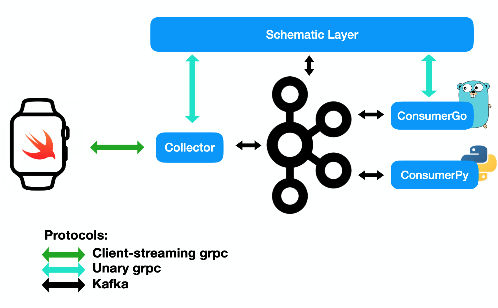

# Schematic
High performance message collection and shema managment

## Notes

- Schematic Layer is registers and maintains message schemas. It allows services to decode unknown messages at run time and verify their integrity.
- Collector is a high performance generic message collection service. It receives messages from a watch through a client-streaming grpc connection. 
- ConsumerPy is using generated code to consume the messages.
- ConsumeGo is not aware of the schema of consumed messages. It is able to deserialize and manipulate them by fetching their file descriptor from the schematic layer.

## Demo

> left: consumerGo, middle: watchExporter App, right: consumerPy

### Flow

1) Apple Watch app establishes client-sctreaming grpc connection with collector.
2) Collector, consumer, and schematic layer establish connection with the kafka broker.
3) Biometric message schema (file descriptor) is registered with the schematic layer.
4) ConsumeGo fetches biometric schema.
5) Apple Watch app begins streaming biometric data.
6) ConsumerPy receives messages and deserializes them with pre-generated code.
7) ConsumerGo receives messages and deserializes them with previously fetched schema.

### Stress Test
